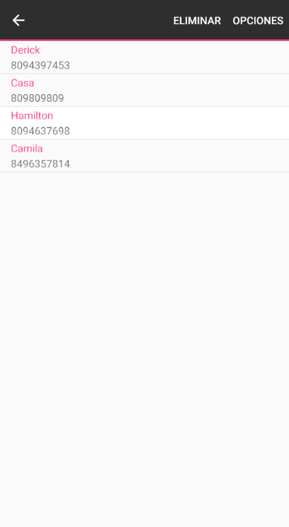
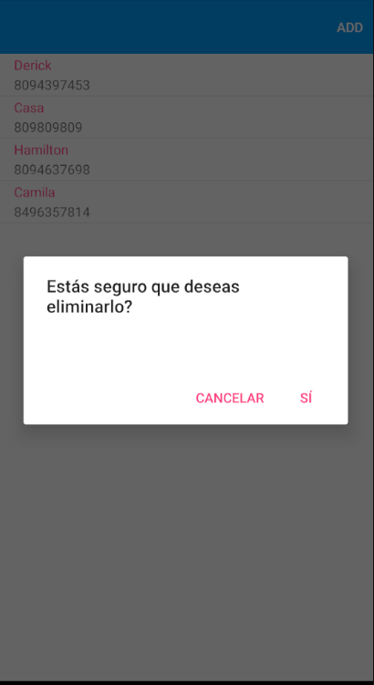
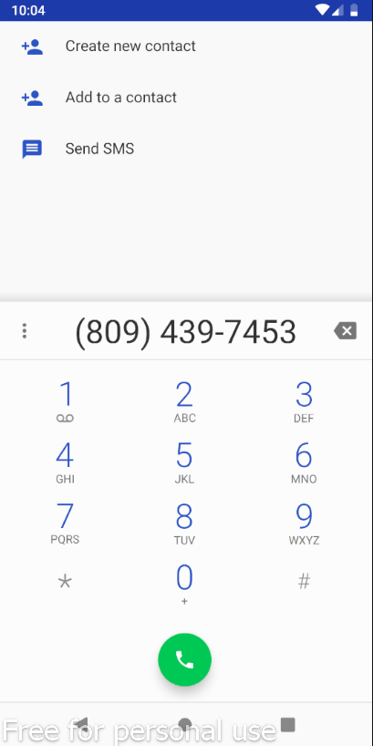

# ContactListXamarin

This application is based the contact app from our phones. The idea is to have an application that can help you to add, edit and delete contacts, with some others actions too.

When you open the app, it will be empty, just with the add button at the top right corner.

Because of the minimalism of the application, it's hard to get lost. Now you can add some friends into your list:

If you let one of the contacts press for a long time (or swipe to the left in IOS) it will display some extra options

Delete will erase the contact, but only if you confirm the action.

Options will display an menu with two more actions:
1.Edit, when you press this one down it will send you to a similar page of add, but with the information of the contact already tiped in the entries, so you can change the 
property that you want, maybe if the user change his or her number or simply because you misspelled it.
2. Call the number, wich will send you tu the call app of your phone whith the number so you can just click the green button and call that contact.

